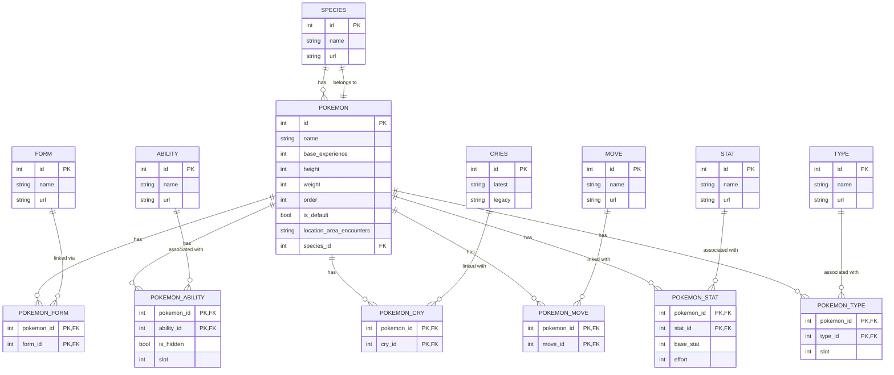
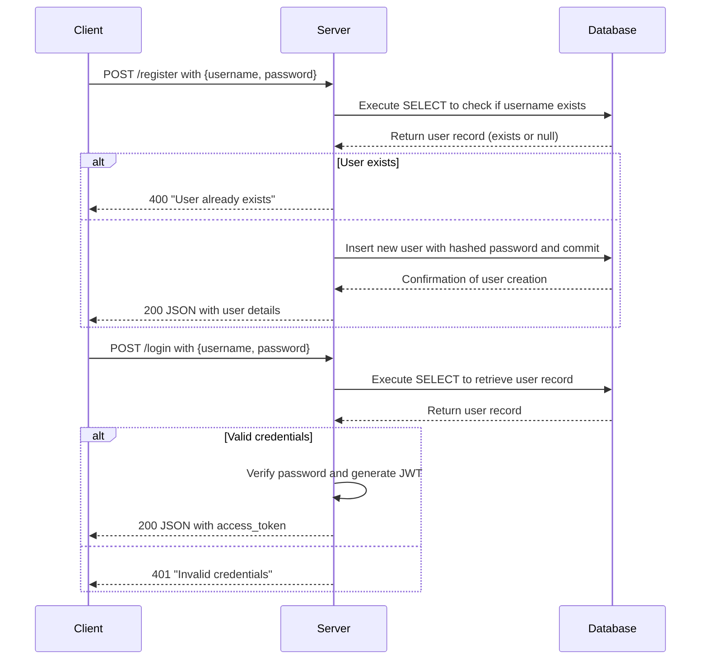

# Pokémon Scouting Data Implementation

Welcome to the Pokémon API documentation. This API provides a comprehensive set of endpoints designed to interact with and manage Pokémon data within a database. Whether you're looking to retrieve Pokémon by specific types, fetch top Pokémon based on attributes such as base experience, or even calculate aggregate statistics like average HP, this API offers the necessary tools for your application.

In addition to data retrieval, the API includes a dedicated ingestion endpoint that allows you to collect and store Pokémon data from an external source. This ingestion process not only fetches detailed Pokémon information but also parses and inserts related records such as Species, Abilities, Stats, and more into the database.

All endpoints are secured with JWT authentication, ensuring that only authorized users can access and modify the data. Below, you will find detailed documentation on each endpoint, including required parameters, request/response formats, and practical examples to help you get started quickly.
The idea of this project is to run a Flask Application the will integrate with the PokeAPI (https://pokeapi.co/) and will allow the user to search for a Pokémon by name and return the following information:

- Species
- Pokémon
- Forms
- Abilities
- Cries
- Types
- Stats
- Moves

## Database Model



## How to setup the project

- Clone the Project

```bash
git clone https://github.com/mwencelewski/pokemon_scout_app.git
```

- Setup Virtualenv and Activate Environment

```bash
python -m venv .venv
source /.venv/bin/activate
```

- Install Requirements

```
pip install -r requirements.txt
```

- Migrate Database

```bash
cd app
alembic upgrade head
```

- Execute API

```bash
cd app
flask run --port 38888 --host 0.0.0.0
```

_The API Swagger documentation can be accessed through http://localhost:38888/apidocs_

## Running the first time

### 1 - Create User and Login

**POST `/register`**

**Description:**  
This endpoint registers a new user by accepting a JSON object with a username and password. It checks if the user already exists and returns an error if so.

**Consumes:**

- application/json

**Produces:**

- application/json

**Request Body:**

- `username` (string, required): The desired username.
- `password` (string, required): The desired password.

**Responses:**

- **200 OK:** User created successfully. Returns a JSON object containing the `username` of the newly created user.
- **400 Bad Request:** User already exists or invalid input. Returns a JSON object with an error message.

---

**POST `/login`**

**Description:**  
This endpoint authenticates a user by verifying the provided username and password. If the credentials are valid, a JWT access token is generated and returned. Otherwise, an error message is returned.

**Consumes:**

- application/json

**Produces:**

- application/json

**Request Body:**

- `username` (string, required): The user's username.
- `password` (string, required): The user's password.

**Responses:**

- **200 OK:** Login successful. Returns a JSON object containing an `access_token` (JWT access token for authenticated requests).
- **401 Unauthorized:** Invalid credentials provided. Returns a JSON object with an error message.

## Authentication



### 2 - Collect the Pokemons data you want

**POST `/pokemon/collect`**

**Description:**  
This endpoint ingests Pokémon data into the database. It accepts a JSON payload containing a list of Pokémon names or IDs under the key `pokemon`. For each provided Pokémon, the endpoint fetches data from an external Pokémon API, parses the data, and inserts multiple related records (Species, Pokémon, Abilities, Cries, Type, Stats, Forms, Moves) into the database. If an error occurs during data fetching for any Pokémon, an error is recorded for that Pokémon and the process continues with the others.

**Security:**  
Requires JWT authentication. Include your token in the request header as:"Authorization: Bearer <your_token>".

**Consumes:**

- `application/json`

**Produces:**

- `application/json`

**Request Body:**  
A JSON object with the following property:

- **pokemon** (array of strings, required): List of Pokémon names or IDs to be ingested.

**Response:**

- **200 OK:** Returns a JSON array containing ingestion results for each Pokémon. Each result object includes:
  - `pokemon` (string): The Pokémon identifier that was processed.
  - `status` (string): Ingestion status for the Pokémon (e.g., "ingested", "error").

## Extra Endpoints

All endpoints require authentication. Include your JWT token in the request header as "Authorization: Bearer <your_token>".

**GET `/pokemon`**  
_Description:_ Retrieve Pokémon records filtered by type.  
_Query Parameter:_

- **type** (string, required): The Pokémon type to filter by.  
  _Response:_
- **200 OK:** JSON array of Pokémon objects (e.g., with `id` and `name`).
- **400 Bad Request:** Error message if the `type` parameter is missing.  
  _Example:_ `GET /pokemon?type=fire`

**GET `/pokemon/top`**  
_Description:_ Retrieve the top Pokémon based on ordering and limit.  
_Query Parameters:_

- **limit** (integer, optional, default: 10): Maximum number of Pokémon to return.
- **order_by** (string, optional, default: `base_experience_desc`): Field and order for sorting.  
  _Response:_
- **200 OK:** JSON array of Pokémon objects (including `id`, `name`, and `base_experience`).  
  _Example:_ `GET /pokemon/top?limit=5&order_by=base_experience_desc`

**GET `/pokemon/with-species`**  
_Description:_ Retrieve Pokémon along with their species details.  
_Response:_

- **200 OK:** JSON array of objects containing `id`, `name`, `species` (species name), and `species_id`.  
  _Example:_ `GET /pokemon/with-species`

**GET `/types/pokemon-count`**  
_Description:_ Retrieve the count of Pokémon for each type.  
_Response:_

- **200 OK:** JSON array of objects, each with `type_name` and `total_pokemons`.  
  _Example:_ `GET /types/pokemon-count`

**GET `/stats/hp/average`**  
_Description:_ Retrieve the average HP (Hit Points) of all Pokémon.  
_Response:_

- **200 OK:** JSON array containing an object with the property `average_hp`.  
  _Example:_ `GET /stats/hp/average`

# Aplication Workflow


# Improvement Points

- Caching for Responses
- Usage of a Design Pattern for the DB Client module
- Add Roles to enhance security
- Breaking down into two services integrated with a Queue Service

